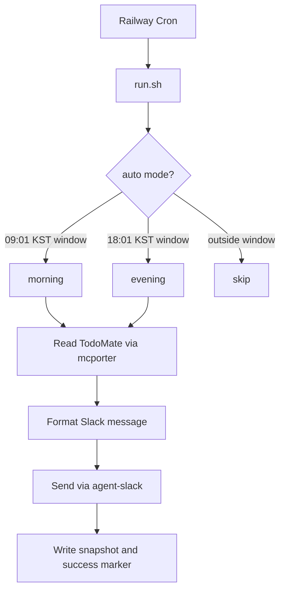

# TodoMate Slack Daily Reporter

TodoMate의 오늘 할 일을 읽어 Slack DM/채널로 보내는 Railway Cron 자동화입니다.

- 오전 리포트: 오늘 예정 작업 목록 전송
- 저녁 리포트: 오전 스냅샷과 저녁 TodoMate 상태를 비교해 4개 카테고리로 전송
- Railway Volume 또는 Redis에 상태 저장
- 중복 발송 방지용 날짜/모드별 marker + 실행 lock 포함

> 현재 버전은 **1인 1 Railway 서비스**에 가장 적합합니다. 여러 사용자가 함께 쓰는 SaaS 형태로 운영하려면 사용자별 인증/설정/상태를 DB로 분리하는 리팩터가 필요합니다.

## Message format

### Morning

```text
[WORK] proposal review - 30m
[OPS] weekly planning - 1h
```

### Evening

```text
당일 예정 작업이 완료된 것
- ...

예정 작업이 수정되어 완료된 것
- ...

추가된 작업이 완료된 것
- ...

추가된 작업이 미완료된 것
- ...
```

## How it works



## Requirements

- Railway account
- Slack workspace access
- TodoMate account accessible through `mcporter`
- Node packages:
  - `mcporter`
  - `agent-messenger`

The Docker image installs these automatically from `package.json`.

## Environment variables

Copy `.env.example` and fill the required values.

| Variable | Required | Description |
| --- | --- | --- |
| `TODOMATE_SLACK_CHANNEL_ID` | Yes | Slack DM/channel ID to send reports to. Usually starts with `D` for DM or `C` for channel. |
| `MCPORTER_CREDENTIALS_JSON_B64` | Yes on Railway | Base64-encoded `~/.mcporter/credentials.json`. |
| `AGENT_MESSENGER_SLACK_CREDENTIALS_JSON_B64` | Yes on Railway | Base64-encoded `~/.config/agent-messenger/slack-credentials.json`. |
| `TODOMATE_RUN_MODE` | No | `auto`, `morning`, `evening`, or `diagnose`. Default: `auto`. |
| `TODOMATE_FORCE` | No | Set `1` only for manual forced sends. Default: `0`. |
| `TODOMATE_TIMEZONE` | No | Default: `Asia/Seoul`. |
| `TODOMATE_EXCLUDED_GOALS` | No | Comma-separated TodoMate categories/goals to exclude. Example: `STUDY,LIFE`. |
| `TODOMATE_STATE_DIR` | No | State directory. On Railway use `/data/state` with a mounted volume. |
| `TODOMATE_LOG_DIR` | No | Log directory. On Railway use `/data/logs`. |
| `TODOMATE_SCHEDULE_TOLERANCE_MINUTES` | No | Auto-mode time window tolerance. Default: `10`. |
| `TODOMATE_REDIS_URL` / `REDIS_URL` | No | Optional shared state store. Local files still remain as fallback/cache. |

## Local setup

```bash
git clone https://github.com/YOUR_GITHUB_USERNAME/todomate-slack-daily-reporter.git
cd todomate-slack-daily-reporter
npm install
cp .env.example .env
```

Authenticate the local CLIs first:

```bash
npx mcporter --help
npx agent-slack auth status --pretty
```

Then run a dry test:

```bash
TODOMATE_RUN_MODE=morning TODOMATE_FORCE=1 python3 send-todomate-slack-report.py morning --dry-run --force
```

Send manually only when you are sure the Slack channel is correct:

```bash
TODOMATE_RUN_MODE=morning TODOMATE_FORCE=1 python3 send-todomate-slack-report.py morning --force
```

## Railway deployment

### 1. Create a Railway project

```bash
railway login
railway init
```

### 2. Add a volume

Create a Railway Volume and mount it at:

```text
/data
```

This keeps morning snapshots available for the evening comparison.

### 3. Encode local credentials

Do **not** commit credential files. Encode them and store them as Railway variables.

```bash
base64 -i ~/.mcporter/credentials.json | tr -d '\n'
base64 -i ~/.config/agent-messenger/slack-credentials.json | tr -d '\n'
```

### 4. Set Railway variables

```bash
railway variables --set TODOMATE_SLACK_CHANNEL_ID=D1234567890
railway variables --set MCPORTER_CREDENTIALS_JSON_B64='<PASTE_BASE64_VALUE>'
railway variables --set AGENT_MESSENGER_SLACK_CREDENTIALS_JSON_B64='<PASTE_BASE64_VALUE>'
railway variables --set TODOMATE_RUN_MODE=auto
railway variables --set TODOMATE_FORCE=0
railway variables --set TODOMATE_TIMEZONE=Asia/Seoul
railway variables --set TODOMATE_STATE_DIR=/data/state
railway variables --set TODOMATE_LOG_DIR=/data/logs
railway variables --set TODOMATE_SCHEDULE_TOLERANCE_MINUTES=10
```

Optional:

```bash
railway variables --set TODOMATE_EXCLUDED_GOALS='STUDY,LIFE'
```

### 5. Deploy

```bash
railway up --detach
```

`railway.json` uses this cron schedule:

```cron
1 0,9 * * 1-5
```

That is UTC, so with `Asia/Seoul` it runs at:

- 09:01 KST on weekdays
- 18:01 KST on weekdays

`run.sh` decides whether the current run is morning or evening based on the configured timezone.

## Manual operations

### Dry-run morning

```bash
python3 send-todomate-slack-report.py morning --dry-run --force
```

### Force morning send

```bash
TODOMATE_FORCE=1 python3 send-todomate-slack-report.py morning --force
```

### Force evening send

```bash
TODOMATE_FORCE=1 python3 send-todomate-slack-report.py evening --force
```

### Diagnose

```bash
python3 send-todomate-slack-report.py diagnose
```

## Duplicate-send protection

The script has two protections:

1. `mode.lock`: prevents simultaneous schedulers from sending the same report at the same time.
2. `mode.success.json`: skips a report that was already successfully sent for the same date and mode.

For Railway, mount `/data` so these files survive between cron runs.

## Multi-user roadmap

This repository is intentionally simple. To support multiple users in one hosted app, change the architecture like this:

```text
Current:
Railway env vars -> one TodoMate account -> one Slack target -> one /data state

Multi-user:
users table -> user credentials -> user Slack target -> user-specific daily snapshots
```

Recommended tables:

- `users`: timezone, morning/evening time, Slack target, excluded categories
- `credentials`: encrypted TodoMate/Slack credentials per user
- `daily_snapshots`: user_id, date, mode, items, sent_at
- `send_events`: user_id, date, mode, status, error

Recommended scheduler:

```text
Run every 5 minutes
-> find users due for morning/evening report
-> run each user with isolated credentials and state
-> skip if user_id + date + mode already sent
```

## Security notes

- Never commit `.env`, `credentials.json`, or `slack-credentials.json`.
- Treat base64 values as secrets. Base64 is encoding, not encryption.
- If you build a multi-user product, encrypt credentials at rest and add a disconnect/delete flow.

## Contributing

Pull requests are welcome. Good first improvements:

- Better Slack message templates
- A web onboarding page
- Proper OAuth setup flow
- Tests for TodoMate item diffing
- Postgres-backed multi-user scheduler
