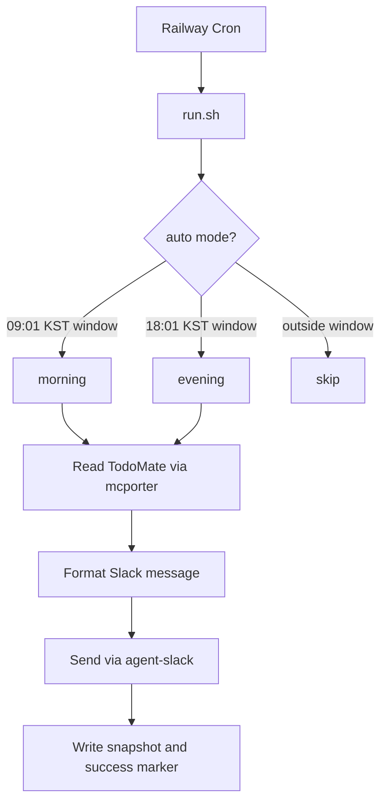

# TodoMate Slack Daily Reporter

TodoMate의 오늘 할 일을 읽어 Slack DM/채널로 보내는 Railway Cron 자동화입니다.

- 오전 리포트: 오늘 예정 작업 목록 전송
- 저녁 리포트: 오전 스냅샷과 저녁 TodoMate 상태를 비교해 4개 카테고리로 전송
- Railway Volume 또는 Redis에 상태 저장
- 중복 발송 방지용 날짜/모드별 marker + 실행 lock 포함

## Why Railway?

이 자동화는 정해진 시간에 스스로 실행되어야 합니다. 로컬 `cron`, macOS `launchd`, Windows Task Scheduler로도 비슷한 자동화를 만들 수 있지만, 그 방식은 **데스크탑/노트북이 켜져 있고 네트워크에 연결되어 있을 때만** 안정적으로 동작합니다.

예를 들어 노트북을 닫아두거나, 절전 모드에 들어가거나, 전원이 꺼져 있으면 오전/저녁 리포트가 실행되지 않을 수 있습니다.

Railway를 쓰는 이유는 다음과 같습니다.

- 개인 노트북 상태와 무관하게 클라우드에서 cron 실행
- Railway Volume으로 오전 snapshot을 저장하고 저녁 비교에 재사용
- 환경변수로 TodoMate/Slack 인증 정보를 서버에 안전하게 주입
- 배포, 로그 확인, 재실행, 스케줄 변경을 한 곳에서 관리

즉, 이 프로젝트의 기본 운영 모델은 다음과 같습니다.

```text
Local laptop cron
-> works only while your machine is awake and online

Railway cron
-> works from the cloud on schedule, even when your machine is closed/offline
```

> 현재 버전은 **1인 1 Railway 서비스**에 가장 적합합니다. 여러 사용자가 함께 쓰는 SaaS 형태로 운영하려면 사용자별 인증/설정/상태를 DB로 분리하는 리팩터가 필요합니다.

## 메시지 형식

Slack 메시지는 DM과 채널 어디서든 바로 읽을 수 있도록 단순 텍스트로 발송됩니다. 별도의 Slack Block Kit 설정은 필요하지 않습니다.

### 오전 / 작업 전 보고

오전 보고는 TodoMate에 등록된 당일 예정 작업을 목록으로 보냅니다.

각 작업은 다음 형식으로 표시됩니다.

```text
[카테고리] 작업 목록 - 시간
```

예시:

```text
[업무] 제안서 검토 - 30분
[회의] 주간 미팅 - 1시간
[정산] 비용 확인 - 10분
```

### 저녁 / 작업 후 보고

저녁 보고는 오전에 저장한 스냅샷과 저녁 TodoMate 상태를 비교한 뒤, 긴 비교 설명 없이 4개 카테고리로만 나누어 보냅니다.

각 항목은 오전과 동일하게 다음 형식을 사용합니다.

```text
[카테고리] 작업 목록 - 시간
```

예시:

```text
YYYY-MM-DD TodoMate 저녁 보고

1. 당일 예정 작업이 완료된 것
- [카테고리] 작업 목록 - 시간

2. 예정 작업이 수정되어 완료된 것
- [카테고리] 수정된 작업 목록 - 시간

3. 추가된 작업이 완료된 것
- [카테고리] 새로 추가된 완료 작업 - 시간

4. 추가된 작업이 미완료된 것
- [카테고리] 새로 추가된 미완료 작업 - 시간
```

해당 카테고리에 표시할 작업이 없으면 다음처럼 표시됩니다.

```text
- 없음
```

저녁 보고의 4개 카테고리는 다음 기준으로 나뉩니다.

1. 오전에 이미 예정되어 있었고, 저녁 기준 완료된 작업
2. 오전 예정 작업이었지만 내용이 수정된 뒤 완료된 작업
3. 오전 보고 이후 새로 추가되었고 완료된 작업
4. 오전 보고 이후 새로 추가되었지만 아직 미완료인 작업

## How it works



## 준비물

로컬 테스트를 위해 필요합니다.

- TodoMate 계정
- Slack 워크스페이스 접근 권한
- 보고를 보낼 Slack DM 또는 채널
- Node.js/npm
- Python 3

Railway 배포를 위해 추가로 필요합니다.

- Railway 계정
- Railway CLI 설치 및 로그인
- `/data` 경로에 마운트된 Railway Volume

이 앱이 사용하는 Node 패키지는 다음과 같습니다.

- `mcporter`: TodoMate 데이터를 읽기 위해 사용
- `agent-messenger`: Slack 메시지를 보내기 위해 사용

Docker 이미지는 `package.json`을 기준으로 위 패키지를 자동 설치합니다.

## 신규 사용자 설정 흐름

처음 사용하는 사람은 아래 순서대로 진행하면 됩니다.

1. 이 저장소를 clone하고 의존성을 설치합니다.
2. `mcporter`로 TodoMate 접근 권한을 인증합니다.
3. `agent-slack`으로 Slack 접근 권한을 인증합니다.
4. Slack DM 또는 채널 ID를 확인합니다.
5. 로컬에서 dry-run으로 TodoMate 추출이 되는지 확인합니다.
6. 로컬 인증 파일을 base64로 인코딩해 Railway 환경변수로 등록합니다.
7. Railway Volume을 `/data`에 마운트하고 배포합니다.
8. Railway cron이 평일 09:01 / 18:01 KST에 실행되도록 둡니다.

이 과정을 마치면 개인 노트북이 꺼져 있어도 Railway에서 오전/저녁 보고가 자동 발송됩니다.

## Environment variables

Copy `.env.example` and fill the required values.

| Variable | Required | Description |
| --- | --- | --- |
| `TODOMATE_SLACK_CHANNEL_ID` | Yes | Slack DM/channel ID to send reports to. Usually starts with `D` for DM or `C` for channel. |
| `MCPORTER_CREDENTIALS_JSON_B64` | Yes on Railway | Base64-encoded `~/.mcporter/credentials.json`. |
| `AGENT_MESSENGER_SLACK_CREDENTIALS_JSON_B64` | Yes on Railway | Base64-encoded `~/.config/agent-messenger/slack-credentials.json`. |
| `TODOMATE_RUN_MODE` | No | `auto`, `morning`, `evening`, or `diagnose`. Default: `auto`. |
| `TODOMATE_FORCE` | No | Set `1` only for manual forced sends. Default: `0`. |
| `TODOMATE_TIMEZONE` | No | Default: `Asia/Seoul`. |
| `TODOMATE_EXCLUDED_GOALS` | No | Comma-separated TodoMate categories/goals to exclude. Example: `STUDY,LIFE`. |
| `TODOMATE_STATE_DIR` | No | State directory. On Railway use `/data/state` with a mounted volume. |
| `TODOMATE_LOG_DIR` | No | Log directory. On Railway use `/data/logs`. |
| `TODOMATE_SCHEDULE_TOLERANCE_MINUTES` | No | Auto-mode time window tolerance. Default: `10`. |
| `TODOMATE_REDIS_URL` / `REDIS_URL` | No | Optional shared state store. Local files still remain as fallback/cache. |

## Local setup

```bash
git clone https://github.com/YOUR_GITHUB_USERNAME/todomate-slack-daily-reporter.git
cd todomate-slack-daily-reporter
npm install
cp .env.example .env
```

### 1. TodoMate 인증

TodoMate는 `mcporter`를 통해 읽습니다. 먼저 TodoMate MCP 서버 설정을 만듭니다.

```bash
mkdir -p ~/.mcporter
cat > ~/.mcporter/mcporter.json <<'JSON'
{"mcpServers":{"mcp-gateway":{"baseUrl":"https://playmcp.kakao.com/mcp","auth":"oauth"}}}
JSON
```

그 다음 브라우저 OAuth 흐름으로 인증합니다.

```bash
npx mcporter auth mcp-gateway
```

TodoMate 접근이 되는지 확인합니다.

```bash
npx mcporter call mcp-gateway.TodoMate-loadGoals
```

### 2. Slack 인증

Slack 메시지는 `agent-slack` CLI로 보냅니다. Slack Desktop 앱 또는 지원되는 Chromium 브라우저에 로그인되어 있어야 합니다.

```bash
npx agent-slack auth extract
npx agent-slack auth status --pretty
```

### 3. Slack DM/채널 ID 확인

보고를 받을 대상의 ID를 확인합니다.

```bash
# 공개 채널 목록 확인
npx agent-slack channel list --type public --pretty

# DM 목록 확인
npx agent-slack channel list --type dm --pretty
```

`TODOMATE_SLACK_CHANNEL_ID`에는 보낼 대상의 ID를 넣습니다. 일반적으로 DM은 `D`로, 채널은 `C`로 시작합니다.

### 4. 로컬 dry-run

TodoMate 추출과 메시지 포맷이 정상인지 먼저 dry-run으로 확인합니다.

```bash
TODOMATE_RUN_MODE=morning TODOMATE_FORCE=1 python3 send-todomate-slack-report.py morning --dry-run --force
```

Send manually only when you are sure the Slack channel is correct:

```bash
TODOMATE_RUN_MODE=morning TODOMATE_FORCE=1 python3 send-todomate-slack-report.py morning --force
```

## Railway deployment

### 0. Railway prerequisites

The commands below assume you have a Railway account and the Railway CLI is installed on your machine.

Create a Railway account:

- https://railway.com

Install Railway CLI:

```bash
# macOS with Homebrew
brew install railway

# or with npm
npm install -g @railway/cli
```

Check that the CLI works:

```bash
railway --version
```

Login from your terminal:

```bash
railway login
```

This opens a browser login flow. Complete it, then return to your terminal.

### 1. Create or link a Railway project

For a new Railway project:

```bash
railway init
```

For an existing Railway project:

```bash
railway link
```

### 2. Add a volume

Create a Railway Volume and mount it at:

```text
/data
```

This keeps morning snapshots available for the evening comparison.

### 3. Encode local credentials

Do **not** commit credential files. Encode them and store them as Railway variables.

```bash
base64 -i ~/.mcporter/credentials.json | tr -d '\n'
base64 -i ~/.config/agent-messenger/slack-credentials.json | tr -d '\n'
```

### 4. Set Railway variables

```bash
railway variables --set TODOMATE_SLACK_CHANNEL_ID=D1234567890
railway variables --set MCPORTER_CREDENTIALS_JSON_B64='<PASTE_BASE64_VALUE>'
railway variables --set AGENT_MESSENGER_SLACK_CREDENTIALS_JSON_B64='<PASTE_BASE64_VALUE>'
railway variables --set TODOMATE_RUN_MODE=auto
railway variables --set TODOMATE_FORCE=0
railway variables --set TODOMATE_TIMEZONE=Asia/Seoul
railway variables --set TODOMATE_STATE_DIR=/data/state
railway variables --set TODOMATE_LOG_DIR=/data/logs
railway variables --set TODOMATE_SCHEDULE_TOLERANCE_MINUTES=10
```

Optional:

```bash
railway variables --set TODOMATE_EXCLUDED_GOALS='STUDY,LIFE'
```

### 5. Deploy

```bash
railway up --detach
```

`railway.json` uses this cron schedule:

```cron
1 0,9 * * 1-5
```

That is UTC, so with `Asia/Seoul` it runs at:

- 09:01 KST on weekdays
- 18:01 KST on weekdays

`run.sh` decides whether the current run is morning or evening based on the configured timezone.

## Manual operations

### Dry-run morning

```bash
python3 send-todomate-slack-report.py morning --dry-run --force
```

### Force morning send

```bash
TODOMATE_FORCE=1 python3 send-todomate-slack-report.py morning --force
```

### Force evening send

```bash
TODOMATE_FORCE=1 python3 send-todomate-slack-report.py evening --force
```

### Diagnose

```bash
python3 send-todomate-slack-report.py diagnose
```

## Duplicate-send protection

The script has two protections:

1. `mode.lock`: prevents simultaneous schedulers from sending the same report at the same time.
2. `mode.success.json`: skips a report that was already successfully sent for the same date and mode.

For Railway, mount `/data` so these files survive between cron runs.

## Multi-user roadmap

This repository is intentionally simple. To support multiple users in one hosted app, change the architecture like this:

```text
Current:
Railway env vars -> one TodoMate account -> one Slack target -> one /data state

Multi-user:
users table -> user credentials -> user Slack target -> user-specific daily snapshots
```

Recommended tables:

- `users`: timezone, morning/evening time, Slack target, excluded categories
- `credentials`: encrypted TodoMate/Slack credentials per user
- `daily_snapshots`: user_id, date, mode, items, sent_at
- `send_events`: user_id, date, mode, status, error

Recommended scheduler:

```text
Run every 5 minutes
-> find users due for morning/evening report
-> run each user with isolated credentials and state
-> skip if user_id + date + mode already sent
```

## Security notes

- Never commit `.env`, `credentials.json`, or `slack-credentials.json`.
- Treat base64 values as secrets. Base64 is encoding, not encryption.
- If you build a multi-user product, encrypt credentials at rest and add a disconnect/delete flow.

## Contributing

Pull requests are welcome. Good first improvements:

- Better Slack message templates
- A web onboarding page
- Proper OAuth setup flow
- Tests for TodoMate item diffing
- Postgres-backed multi-user scheduler
